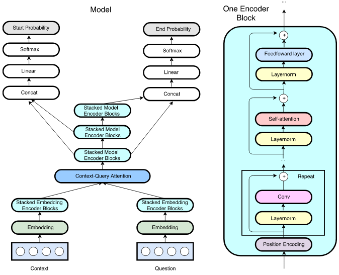

# QANet in Tensorflow

A TensorFlow implementation of [QANet](https://arxiv.org/abs/1804.09541), an efficient reading comprehension model that is exclusively built upon convolutions and self-attentions. By not using recurrent connections, a 13x speedup in training is achieved while maintaining good accuracy. Notably, the EM accuracy score beats human performance on the SQuAD dataset.

<p align="center"> 

</p>

## Requirements

* Python 2.7
* Tensorflow 1.8
* NumPy 1.14.2

## Usage

To create the TensorFlow computation graph of the QANet architecture run:

```$ python main.py```

## Code Organization

The OOP paradigm is followed in structuring the model code in classes. Modularity through extensive use of functions helps abstract complex architecture parts and even Tensorflow functionality (ex: sharing of tensors). File structure:
* `main.py`: File main.py contains the main program. The computation graph for QANet is built here and launched in a session.
* `modules.py`: File modules.py contain helper functions and custom neural layers, written in a modular style. Coupled with the OOP paradigm used to define the computation graph in qanet.py, these functions help in abstracting the complexity of the architecture and Tensorflow features (such as sharing of Tensors) from the computation graph definition in qanet.py. The computation graph can be defined in a simple manner in qanet.py by using calls to functions defined in this file, which take care of the actual complexity.
* `params.py`: File params.py defines a class Params for hyperparameter declarations.
* `qanet.py`: File qanet.py defines the Tensorflow computation graph for the QANet architecture using OOP and modularity. The skeleton of the architecture from inputs to outputs in defined here using calls to wrapper functions defined in modules.py to take care of the inner working of each component. This makes the graph definition easy to code, read and understand. The advantages of OOP, especially abstraction of weight / Tensor sharing and encapsulation of sub component / layer inner working can be realized. Modularity ensures that the functioning of a component can be easily modified in modules.py without changing the skeleton of the QANet architecture defined in this file.

## Author

[@ni9elf](https://github.com/ni9elf)

Nigel Fernandez 

